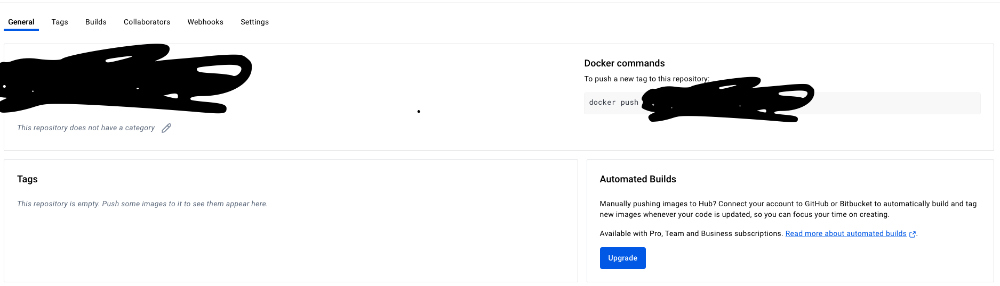
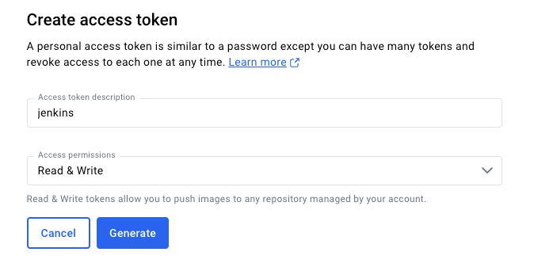

# 들어가며

젠킨스 서버와 웹 서버는 다른 인스턴스에 분리 되어있다

`github` 특정 브랜치에 push 하면 jenkins가 도커 이미지를 빌드해서 도커 레지스트리에 푸시 

웹 서버에서 최신 Docker 이미지를 pull 하여 실행하는 방법을 사용했다

# 진행 과정

1. 도커 레지스트리에 private repository를 생성한다

무료 사용자는 한 계정 당 하나의 private repository만 생성할 수 있다




2. 웹 서버의 `docker-compose.yml` 파일을 작성한다

젠킨스는 github의 소스 코드를 받아 빌드 후 도커 레지스트리에 푸시

SSH를 통해 웹 서버로 접속 후 최슨 도커 이미지를 pull 한다

```yaml
  kcw-backend:
    image: your-registry/your-image-name:latest
    container_name: kcw-backend
    restart: always
    ports:
      - "8080:8080"  # 필요한 포트로 변경하세요
    environment:
      ...이하 생략...
    depends_on:
      - db
```

`docker-compose.yml`을 작성하고 테스트로 실행해보니 아래와 같은 오류가 출력됐다

```shell
 ✘ Error pull access denied for ..                    2.2s
 Error response from daemon: pull access denied for , 
 repository does not exist or may require 'docker login': denied: requested access to the resource is denied
```

원인은 웹 서버에 docker 로그인이 되어있지 않아서다

docker 로그인을 위해서는 계정 토큰 발급이 필요하다



계정 토큰을 발급 받고 docker 로그인을 진행하자

```shell
docker login -u [계정이름]
password: [도커에서 발급받은 토큰]
```

로그인에 성공하면 아래와 같은 메시지가 출력된다

```shell
...생략...
Login Succeeded
...생략...
```


