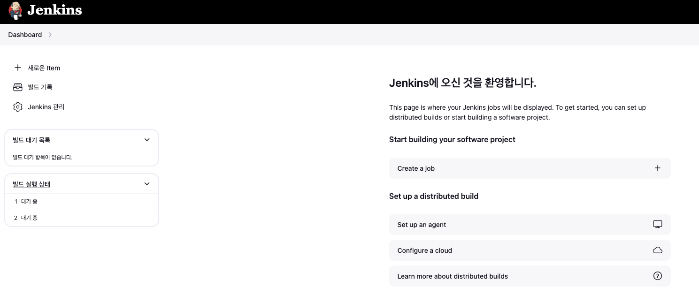
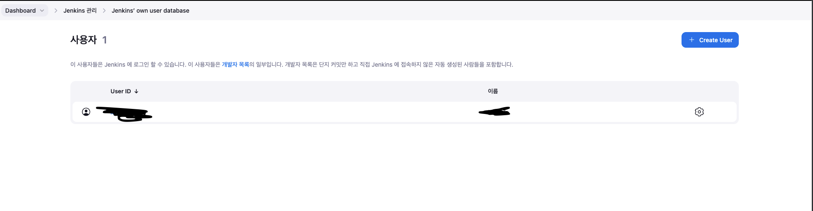
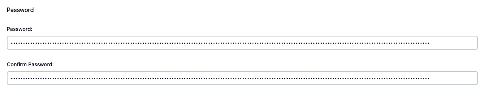
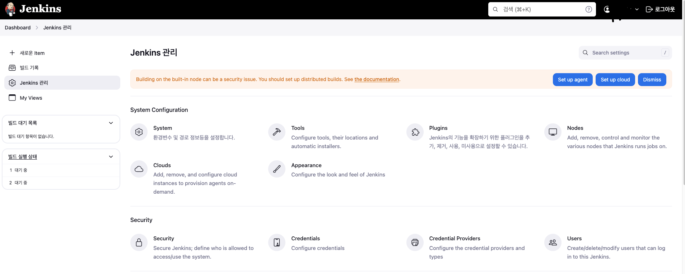

# 들어가며

Jenkins 멀티 서버 배포를 진행하다가 Jenkins 비밀번호를 까먹는 일이 발생했다


# 해결 방법

1. Jenkins가 설치되어 있는 웹 서버에 루트 권한이 있는 계정으로 접속한다

```shell
sudo vi /var/lib/jenkins/config.xml
```

2. `useSecurity`를 false로 바꿔준다

```xml
  <numExecutors>2</numExecutors>
  <mode>NORMAL</mode>
  <useSecurity>false</useSecurity> 
```

3. Jenkins를 재시작 한다

```shell
sudo systemctl restart jenkins
```

4. 비밀번호를 재설정 한다

재시작 후 다시 접속하면 로그인 화면을 건너뛰고 메인페이지로 이동한다



젠킨스 관리 > Users로 들어가면 다음과 같은 화면이 보인다



톱니바퀴 모양을 클릭하고 밑으로 내리면 패스워드 변경 창이 있다



패스워드를 변경하고 save를 눌러준다

`useSecurity`를 true로 바꿔준다

```xml
  <numExecutors>2</numExecutors>
  <mode>NORMAL</mode>
  <useSecurity>true</useSecurity> 
```

5. 젠킨스를 다시 시작한다

변경한 비밀번호로 다시 젠킨스를 접속하면 정상적으로 로그인 된다




