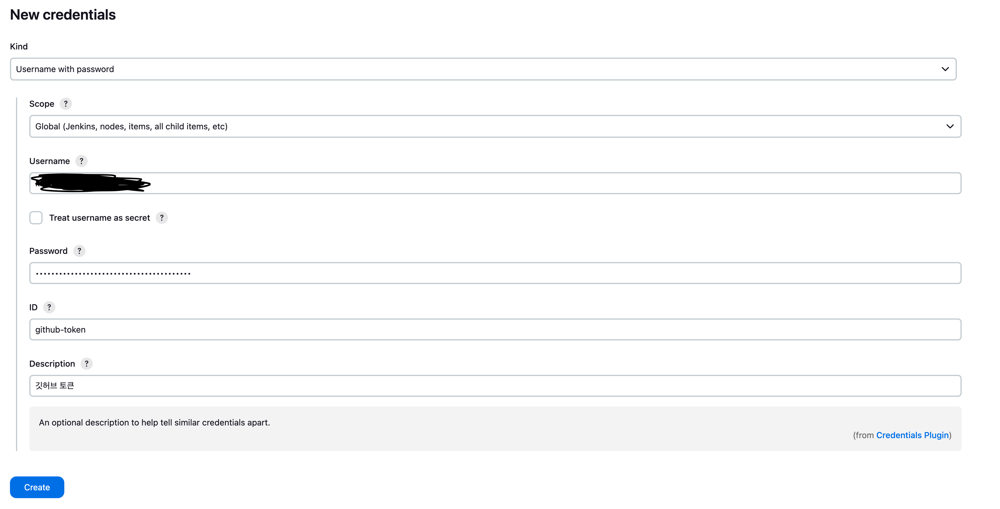
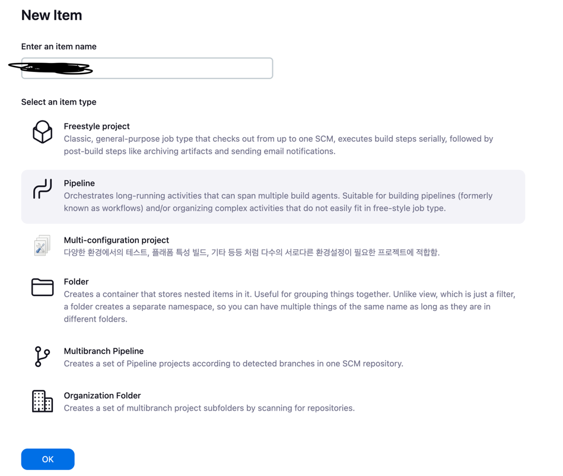
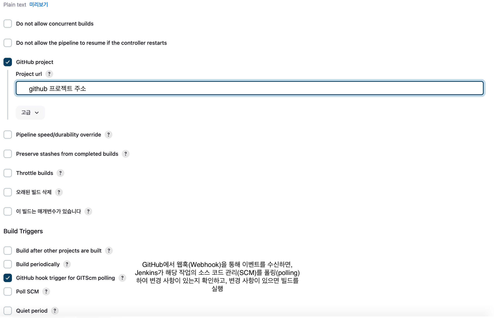
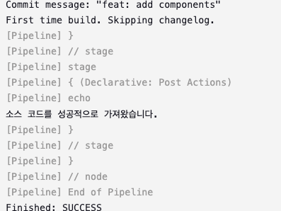

1. Github 리포지토리에서 Jenkins 웹 훅을 등록한다

- 리포지토리 > Settings > Webhooks


`Add Webhook` 버튼을 클릭하면 아래 화면이 나온다


- `Payload URL` : `http://Jenkins주소/github-webhook/`
- `Content type` : `application/json`

위 정보를 기입하고 Add webhook 버튼을 누르면 웹 훅이 등록된다


---

2. Jenkins에 Github 토큰을 저장한다

- Jenkins 관리 > Credentials > System > Global credentials에 들어가서 Github 토큰을 등록한다.



---

3. 새로운 프로젝트를 생성한다



- Github 주소 / 파이프라인 설정을 진행한다



---


4. 파이프라인 설정

```groovy
pipeline {
    agent any

    stages {
        stage('Checkout') {
            steps {
                git branch: 'develop', credentialsId: 'github-token', url: '[Github Repository 주소]'
            }
        }
    }

    post {
        // git clone 성공 이후 실행되는 항목
        success {
            echo '소스 코드를 성공적으로 가져왔습니다.'
        }
        // git clone 실패 이후 실행되는 항목
        failure {
            echo '소스 코드 가져오기에 실패했습니다.'
        }
    }
}
```

5. 테스트 

아직 배포 관련하여 스크립트를 다 작성하지 못했다.

간단하게 Github Repository에 push 할 때, Jenkins에서 clone하는지만 테스트 해보도록 한다


6. 결과



Jenkins / Github 연동이 완료되었다
