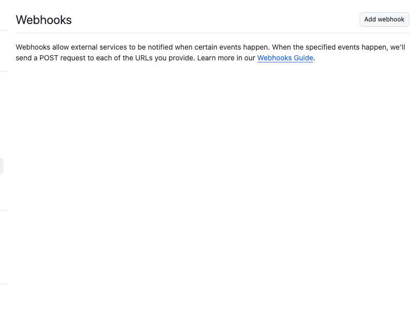
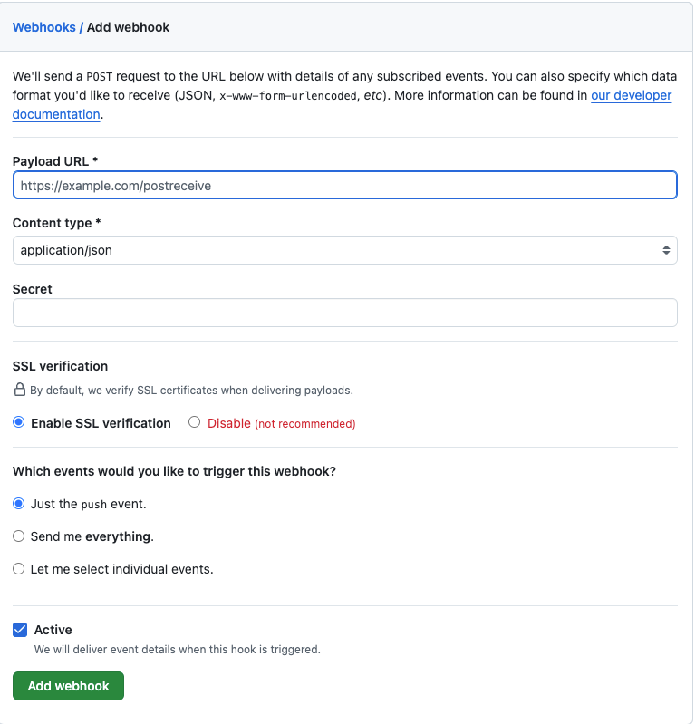
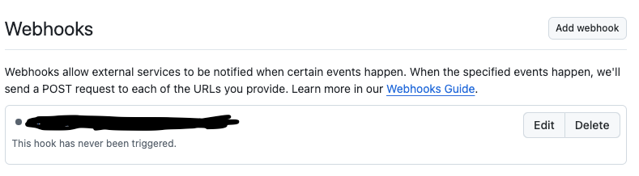

1. Github 리포지토리에서 Jenkins 웹 훅을 등록한다

- 리포지토리 > Settings > Webhooks

`Add Webhook` 버튼을 클릭하면 아래 화면이 나온다

- `Payload URL` : `http://Jenkins주소/github-webhook/`
- `Content type` : `application/json`

위 정보를 기입하고 Add webhook 버튼을 누르면 웹 훅이 등록된다

2. Jenkins에 Github 토큰을 저장한다

