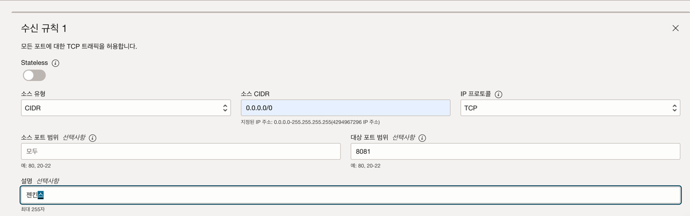
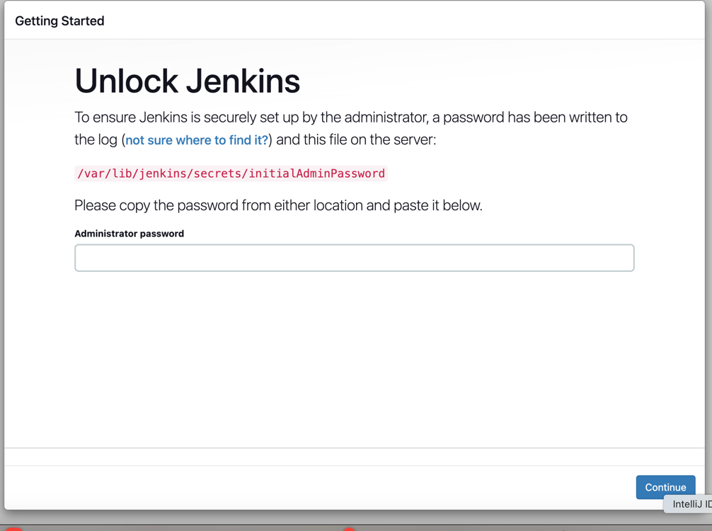

# 들어가며

현재 오라클은 다음과 같은 무료 인스턴스를 제공하고 있다

- ARM : 최대 4코어 / 램24GB

0r

- AMD : 최대 1코어 / 램 2GB

분할 사용이 가능하기 때문에 나는 `2코어 / 램 12GB` 인스턴스를 2개 생성했다

하나는 `웹 서버` 나머지 하나는 `Jenkins 등` 다른 소프트웨어를 설치하는 용도이다

Jenkins 설치 과정이 복잡해서 기록으로 남기려고 한다

# 설치 과정

1. 우분투에 자바를 설치한다

```shell
apt-get install temurin-21-jdk
```

실행 후 다음과 같은 에러 메시지가 출력되고 설치가 진행되지 않았다

```shell
Reading package lists... Done
Building dependency tree... Done
Reading state information... Done
E: Unable to locate package temurin-21-jdk
```

이유는 리포지토리가 설치되지 않았기 때문이다

리포지토리를 등록해준다

```shell
wget -O - https://packages.adoptium.net/artifactory/api/gpg/key/public | sudo apt-key add -
echo "deb https://packages.adoptium.net/artifactory/deb $(awk -F= '/^VERSION_CODENAME/{print$2}' /etc/os-release) main" | sudo tee /etc/apt/sources.list.d/adoptium.list
sudo apt update
sudo apt-get install temurin-21-jdk
```

자바가 제대로 설치 되었는지 확인한다

```shell
java -version
openjdk version "21.0.4" 2024-07-16 LTS
OpenJDK Runtime Environment Temurin-21.0.4+7 (build 21.0.4+7-LTS)
OpenJDK 64-Bit Server VM Temurin-21.0.4+7 (build 21.0.4+7-LTS, mixed mode, sharing)
```

정상적으로 자바가 설치되었다

2. 젠킨스를 설치한다

```shell
sudo wget -O /usr/share/keyrings/jenkins-keyring.asc \
  https://pkg.jenkins.io/debian-stable/jenkins.io-2023.key

echo deb [signed-by=/usr/share/keyrings/jenkins-keyring.asc] \
  https://pkg.jenkins.io/debian-stable binary/ | sudo tee \
  /etc/apt/sources.list.d/jenkins.list > /dev/null

sudo apt-get update

sudo apt-get install jenkins
```

젠킨스의 포트를 변경한다

```shell
sudo vi /etc/default/jenkins
```

> HTTP_PORT=8081 
>  
> 이 부분을 변경한다

```shell
sudo systemctl restart jenkins.service
```

다시 시작해도 jenkins의 포트가 바뀌지 않았다

한번 다른 방법을 사용해보자

```shell
sudo vi /etc/init.d/jenkins
```

```shell
# 이 부분을 변경한다
check_tcp_port "http" "${HTTP_PORT}" "8081" "${HTTP_HOST}" "0.0.0.0" || return 2
```

재시작을 해도 변경되지 않아서 아래 방법을 통해 해결되었다

```shell
sudo vi /usr/lib/systemd/system/jenkins.service

# Port to listen on for HTTP requests. Set to -1 to disable.
# To be able to listen on privileged ports (port numbers less than 1024),
# add the CAP_NET_BIND_SERVICE capability to the AmbientCapabilities
# directive below.
# 변경하기
Environment="JENKINS_PORT=8081"
```

```shell
sudo systemctl daemon-reload
sudo systemctl restart jenkins
```

재시작하고 확인해보니

```shell
● jenkins.service - Jenkins Continuous Integration Server
     Loaded: loaded (/lib/systemd/system/jenkins.service; enabled; vendor preset: enabled)
     Active: active (running) since Wed 2024-10-30 11:21:58 UTC; 3min 1s ago
   Main PID: 4432 (java)
      Tasks: 44 (limit: 14232)
     Memory: 324.3M
        CPU: 12.088s
     CGroup: /system.slice/jenkins.service
             └─4432 /usr/bin/java -Djava.awt.headless=true -jar /usr/share/java/jenkins.war --webroot=/var/cache/jenkins/war --httpPort=8081
```

정상적으로 포트번호가 `8081`로 변경된 것을 확인할 수 있다

3. 젠킨스 포트 열어주기

젠킨스에 접속하기 위해 젠킨스가 실행되고 있는 서버의 8081 포트를 열어준다



서버 내부의 방화벽도 열어준다

```shell
sudo iptables -I INPUT 4 -p tcp --dport 8081 -j ACCEPT

sudo netfilter-persistent save
```
 
설정을 완료하고 젠킨스에 접속해보자




정상적으로 젠킨스에 접속되는 것을 확인할 수 있다

