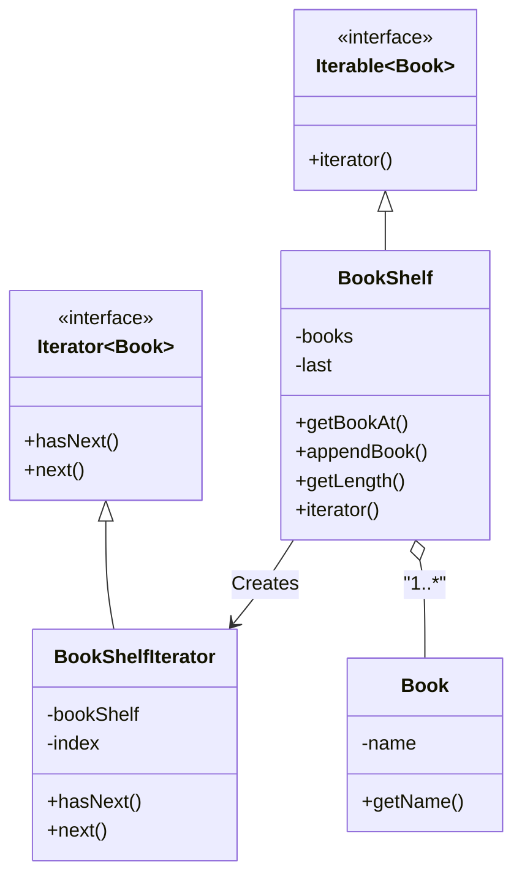

# Iterator 패턴이란 ?

> 무엇인가 많이 모여 있을 때 순서대로 가리키는 것

---
# 예제

```mermaid
classDiagram
    class Iterable~Book~ {
        <<interface>>
        +iterator()
    }

    class Iterator~Book~ {
        <<interface>>
        +hasNext()
        +next()
    }

    class BookShelf {
        -books
        -last
        +getBookAt()
        +appendBook()
        +getLength()
        +iterator()
    }

    class BookShelfIterator {
        -bookShelf
        -index
        +hasNext()
        +next()
    }

    class Book {
        -name
        +getName()
    }

    Iterable~Book~ <|-- BookShelf
    Iterator~Book~ <|-- BookShelfIterator
    BookShelf --> BookShelfIterator : Creates
    BookShelf o-- Book : "1..*"

```
