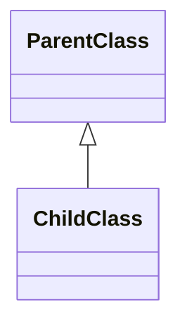
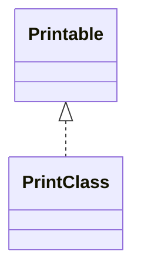
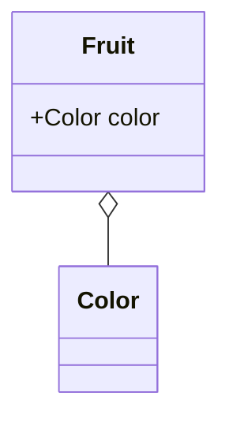

# UML(Unified Modeling Language) 란 ?
> 시스템을 시각화하거나 사양 및 설계를 문서화하기 위한 표현 방법

* `클래스 다이어그램` : 클래스, 인스턴스, 인터페이스 등의 정적인 관계 나타냄


```java
abstract class ParentClass {
    int field1;
    static char field2;
    abstract void methodA();
    double methodB() {}
}

class ChildClass extends ParentClass {
	void methodA() {}
    
    static void methodC() {}
}
```


* 실선 + 삼각형은 상속을 나타냄

* 점선 + 삼각형은 구현을 나타냄


* 인스턴스를 가지고 있으면 집약(마름모 꼴)
```java
class Color {}
class Fruit {
    Color color;
}
```

---


