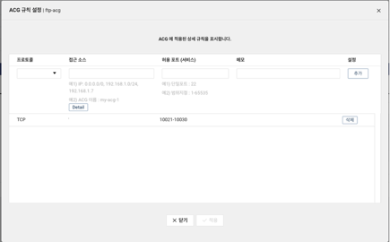

회사에서 네이버 클라우드를 사용하기 시작했다

FTP 설정을 해달라는 요청이 들어와, FTP 설정 방법을 기록으로 남긴다


1. `AGC` 설정

- FTP 서버의 접속 포트와 데이터 포트를 AGC에 등록

**보안성을 위해 10000번 이상의 포트를 사용 권장**




2. 서버에 접속 후 ftp 서버 설치

- ftp 서버 vsftpd 설치

```shell
apt install vsftpd
```


- 사용자 추가

```shell
useradd -g ftp -d /srv/ftp -s /bin/bash [계정이름]

passwd [계정 이름]
```

- vsftpd 설정

```shell
sudo vi /etc/vsftpd.conf

listen=YES
# vsftpd가 독립적인 데몬으로 실행되도록 설정합니다. (주로 standalone 모드에서 사용)

anonymous_enable=NO
# 익명 사용자 접근을 금지합니다. (NO로 설정 시, FTP 서버는 로그인된 사용자만 접근 가능)

local_enable=YES
# 로컬 사용자 계정의 FTP 접근을 허용합니다.

write_enable=YES
# FTP 서버에서 파일 쓰기 및 삭제를 허용합니다.

virtual_use_local_privs=YES
# 가상 사용자가 로컬 사용자와 동일한 파일 권한을 가지도록 설정합니다.

guest_enable=YES
# 게스트 계정을 활성화하여 가상 사용자가 로컬 사용자처럼 로그인할 수 있도록 합니다.

user_sub_token=$USER
# 각 사용자 디렉토리에 대해 `$USER` 변수로 사용자의 이름을 대체합니다. (`local_root`와 함께 사용)

local_root=/srv/ftp
# 로컬 사용자의 기본 디렉토리를 `/srv/ftp`로 설정합니다.

chroot_local_user=YES
# 로컬 사용자를 자신의 홈 디렉토리에 고정(제한)시킵니다.

allow_writeable_chroot=YES
# 쓰기 가능한 디렉토리를 사용하면서도 chroot 기능을 활성화할 수 있도록 합니다. (보안상 주의)

hide_ids=YES
# 디렉토리 목록에서 사용자와 그룹 ID를 숨깁니다.

local_umask=022
# 파일 생성 시 기본 파일 권한을 설정합니다. (기본 022는 새 파일이 755 권한으로 생성됨)

file_open_mode=0644
# 새 파일이 생성될 때의 기본 파일 권한을 설정합니다. (0644는 읽기 및 쓰기 권한을 설정)

listen_port=10021
# FTP 서버가 사용할 포트를 설정합니다. (기본 포트 대신 10021 포트를 사용)

pasv_enable=yes
# 패시브 모드(PASV)를 활성화합니다. (방화벽 및 NAT 환경에서 유용)

pasv_min_port=10022
# 패시브 모드의 최소 포트를 설정합니다.

pasv_max_port=10030
# 패시브 모드의 최대 포트를 설정합니다. (10022~10030 포트 범위 사용)

pasv_addr_resolve=YES
# 호스트 이름을 IP 주소로 해석하여 패시브 모드에 사용할 IP 주소를 설정합니다.

pasv_promiscuous=YES
# 모든 외부 IP에서 패시브 모드를 허용합니다. (보안 위험을 초래할 수 있음)

lock_upload_files=NO
# 파일 업로드 중 잠금(lock)을 사용하지 않도록 설정합니다.
```

3. vsftpd 재시작

```shell
systemctl restart vsftpd
```


---
# 에러 해결

- vsftpd 재시작 후 정상적으로 실행되지 않았다

```shell
● vsftpd.service - vsftpd FTP server
     Loaded: loaded (/lib/systemd/system/vsftpd.service; enabled; vendor preset: enabled)
     Active: failed (Result: exit-code) since Fri 2024-11-01 09:00:36 KST; 2s ago
    Process: 3322853 ExecStartPre=/bin/mkdir -p /var/run/vsftpd/empty (code=exited, status=0/SUCCESS)
    Process: 3322866 ExecStart=/usr/sbin/vsftpd /etc/vsftpd.conf (code=exited, status=2)
   Main PID: 3322866 (code=exited, status=2)
```

아래 명령어를 실행하면 어디서 설정 옵션이 잘못됐는지 보여준다

```shell
sudo vsftpd /etc/vsftpd.conf

500 OOPS: run two copies of vsftpd for IPv4 and IPv6
```
이 오류는 IPv4와 IPv6를 동시에 활성화하려고 할 때 발생한다

설정을 바꿔주고 다시 확인하면 정상적으로 실행되는 것을 볼 수 있다

```shell
● vsftpd.service - vsftpd FTP server
     Loaded: loaded (/lib/systemd/system/vsftpd.service; enabled; vendor preset: enabled)
     Active: active (running) since Fri 2024-11-01 09:03:27 KST; 1s ago
    Process: 3322928 ExecStartPre=/bin/mkdir -p /var/run/vsftpd/empty (code=exited, status=0/SUCCESS)
   Main PID: 3322940 (vsftpd)
      Tasks: 1 (limit: 4611)
     Memory: 632.0K
     CGroup: /system.slice/vsftpd.service
             └─3322940 /usr/sbin/vsftpd /etc/vsftpd.conf

Nov 01 09:03:27 was systemd[1]: Starting vsftpd FTP server...
Nov 01 09:03:27 was systemd[1]: Started vsftpd FTP server.
```


