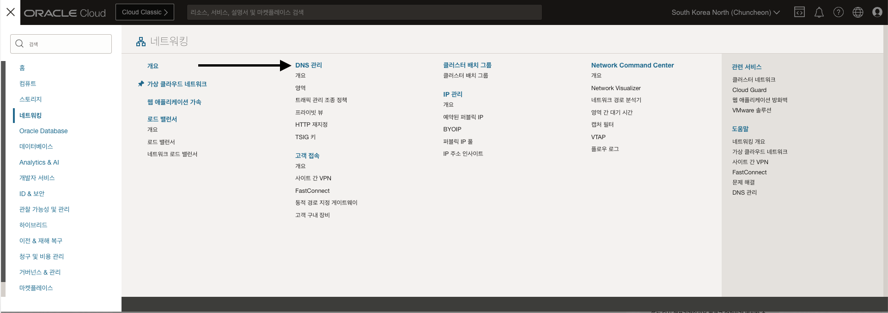
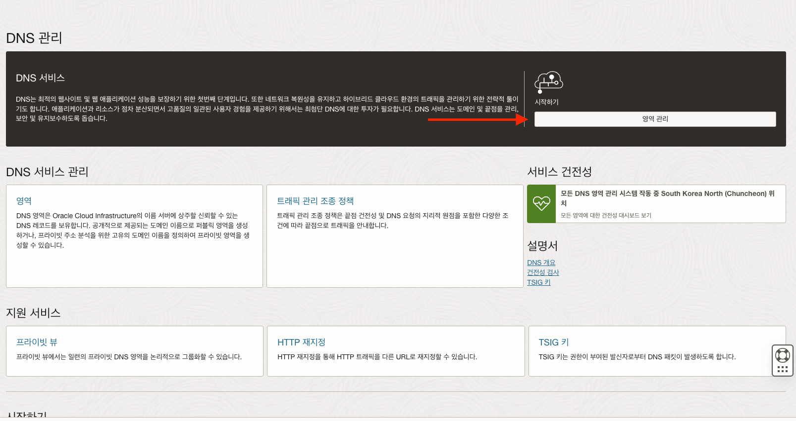
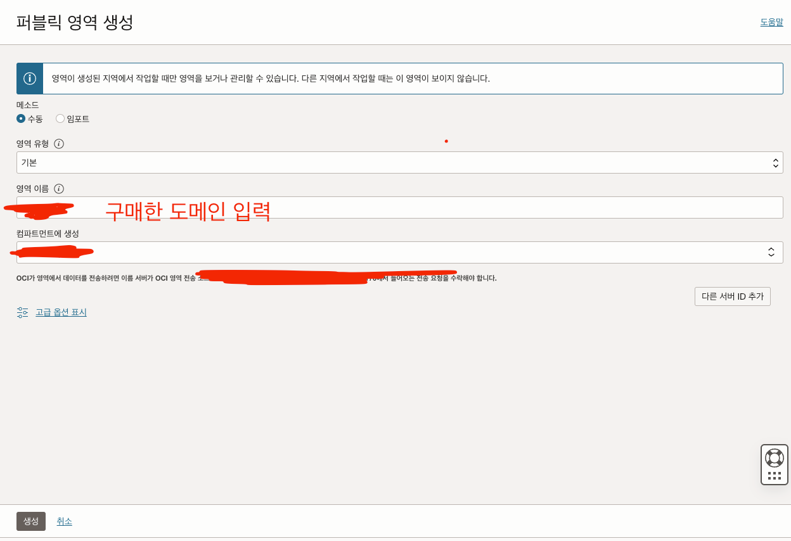
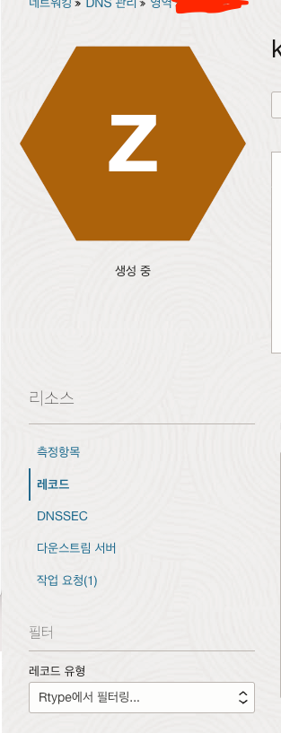
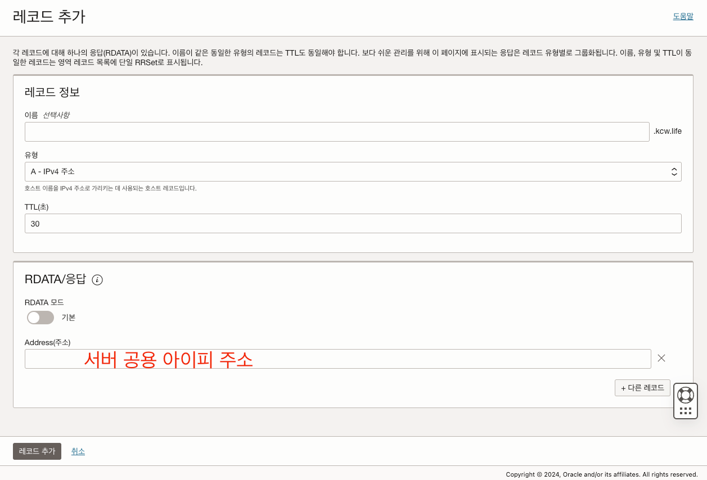
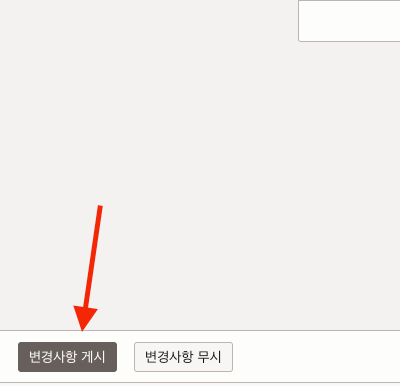
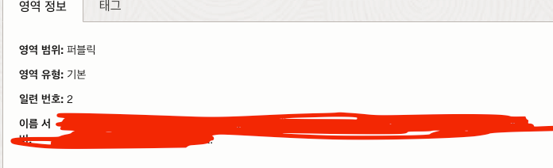
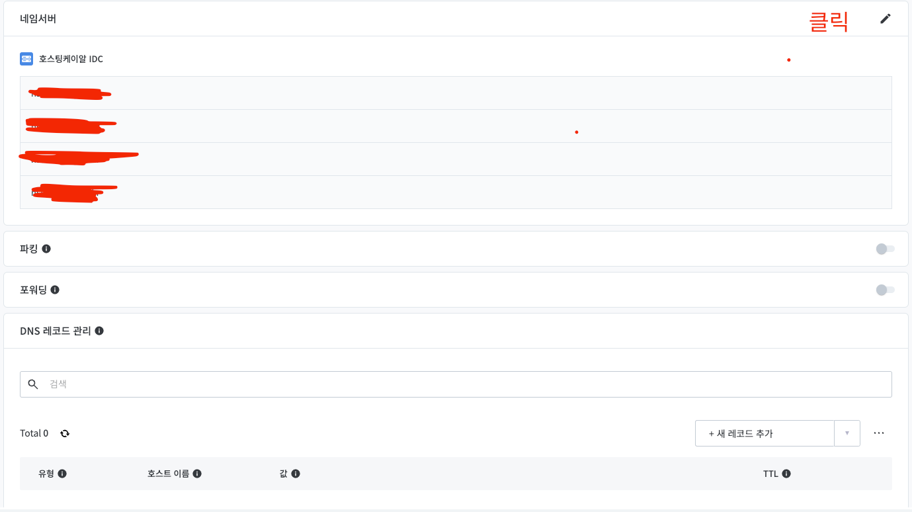

오라클 클라우드에 nextjs 프론트를 배포했다

기왕 배포 한 김에 도메인을 연결해보고 싶어

저렴한 가격에 도메인을 구매했다

# 연결 과정

1. 오라클 클라우드에 접속한다.

2. 좌측 메뉴를 클릭하고 DNS 관리로 들어간다 

3. 영역 관리로 들어간다

4. 퍼블릭 영역 -> 영역 생성 

5. 레코드를 클릭한다

6. 레코드 관리 -> 레코드 추가

7. 레코드 추가 후 변경사항 게시

8. 오라클 네임 서버 확인

9. 오라클 네임 서버 도메인 호스팅 사이트에 등록 (필자의 경우 호스팅 케이알에 등록했다)

도메인 연결 끝
