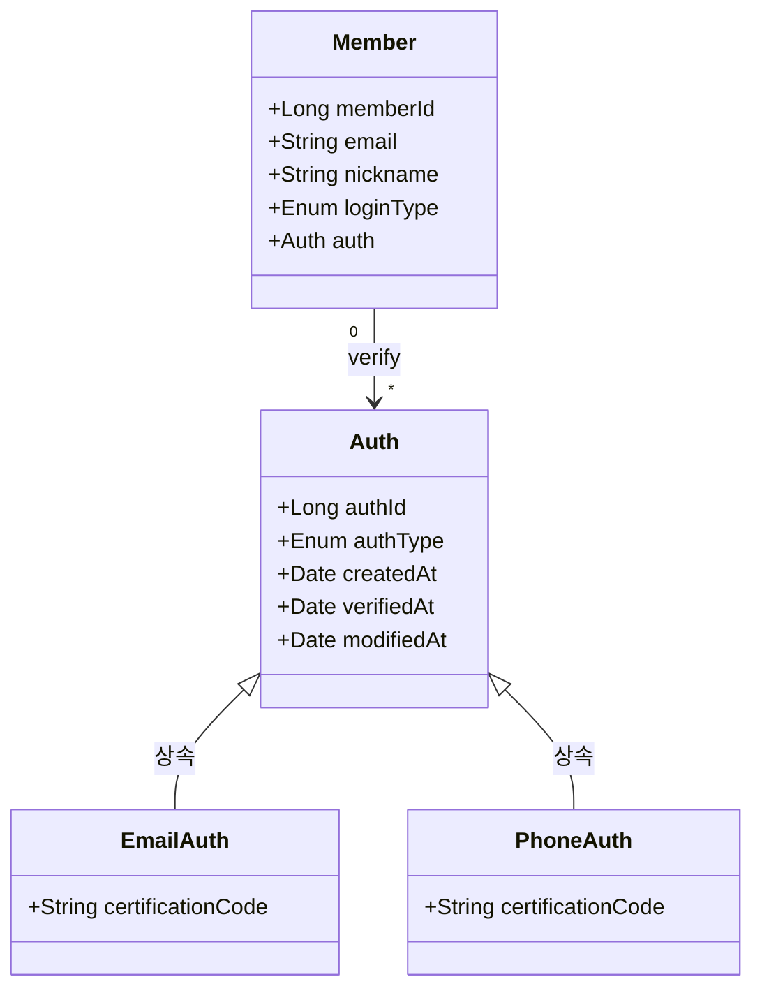

# 현재 상황
{: .fs-9 }

Alllink 프로젝트는 사용자가 링크를 관리하고, 링크를 다른 사람들에게 공유할 수 있는 기능을 목표로 진행하고 있다.
{: .fs-6 .fw-300 }
---

## 현재 기능 요구사항
- 회원은 소셜로그인 / 이메일로 가입할 수 있다. 
- 회원은 이메일로 가입 시 이메일 인증을 해야한다. 
- 소셜 로그인은 네이버, 카카오가 있다. 
- 회원의 닉네임은 중복되어서는 안된다.
- 회원은 개인 소장 링크를 관리 할 수 있다.
- 회원은 개인 소장 링크를 검색할 수 있다.
- 회원은 링크를 폴더에 저장 할 수 있다.
- 회원은 링크에 대표 이미지, 설명, 해시태그를 추가 / 선택 할 수 있다.
- 회원은 내 링크의 공개여부를 설정 할 수 있다.
- 회원은 공개 선택 시에 링크를 특정 공간에 노출할 수 있다.
- 회원은 해시태그를 삭제하고 수정할 수 있다.
- 회원은 링크에 좋아요를 클릭할 수 있다.
- 회원은 좋아요를 클릭한 링크를 모아서 따로 볼 수 있다.
- 회원은 공개한 링크에 댓글을 달 수 있다.
- 회원은 내 정보를 설정 할 수 있다.
- 회원은 개인정보를 수정할 수 있다.
- 관리자는 공지를 올릴 수 있다.
- 회원은 문의를 보낼 수 있다.
- 회원은 탈퇴를 할 수 있다. 

## 다이어그램
요구사항으로부터 도출한 도메인은 다음과 같다.
{: .important }
> - 회원
>
> - 링크
>
> - 인증
> 
> - 댓글

