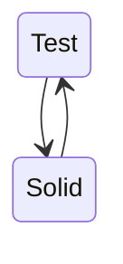

# TDD(테스트주도개발)란?

TDD란 Test Driven Development의 약자로 ‘테스트 주도 개발’이라고 한다.

반복 테스트를 이용한 소프트웨어 방법론으로 작은 단위의 테스트 케이스를 작성하고 이를 통과하는 코드를 추가하는 단계를 반복하여 구현한다.

짧은 개발 주기의 반복에 의존하는 개발 프로세스이며, 애자일 방법론 중 하나인 eXtream Programming(XP)의 ‘Test-First’ 개념에 기반을 둔 단순한 설계를 중요시한다.

이 기법을 개발했거나 ‘재발견’한 것으로 인정되는 Kent Beck은 2003년 TDD가 단순한 설계를 장려하고 자신감을 불어넣어 준다고 말하였다.

{: .note }

> 1. 깨지는 테스트를 먼저 작성한다.
>
> 1. 깨지는 테스트를 성공시킨다.
>
> 1. 리팩토링한다.

# TDD의 목적

- 회귀 버그 방지
- 유연한 설계로 개선
  1. 테스트를 쉽게 만들어줌
  2. 테스트를 결정적이게 만들어준다

# TDD의 장단점

{: .important-title }

> 장점
>
> - 오류나는 테스트를 작성하기 위해 인터페이스 작성이 강제된다.

# TDD 유의사항

- 커버리지에 집착하면 안된다
  - 테스트로 얻을 수 있는 효용성을 생각해야한다

{: .important}

> 커버리지를 올리기 위한 mock 프레임워크 사용법만 고민하지 말고, 왜 테스트를 해야하고, 어떻게 테스트를 해야하는지 고민해야한다.
>
> TDD를 논하기 전에 테스트가 가능한 구조로 변경되어야 함
>
> 중요한 로직을 구분해서, 해당 코드에 테스트를 작성하는게 좋다.

# 번외(좋은 아키텍처는 무엇일까?)

> Solid와 Test는 긴밀한 연관관계를 갖는다.

{: .important-title }

> Solid란 ?
>
> - 단일 책임 원칙 : 테스트가 너무 많다면 책임을 분할해야 할 시점
>
> - 개방 폐쇄 원칙 : 테스트 컴포넌트와 프로덕션 컴포넌트를 나눠 작업, 필요에 따라 컴포넌트를 탈부착
>
> - 인터페이스 분리 원칙 : 테스트에서 불필요한 의존성을 실제로 확인할 수 있다.
>
> - 의존성 역전 원칙 : 가짜 객체를 이용하여 테스트를 작성하려면, 의존성 역전되어있어야 하는 경우 많음
