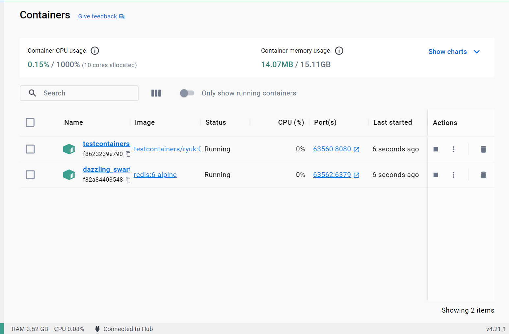
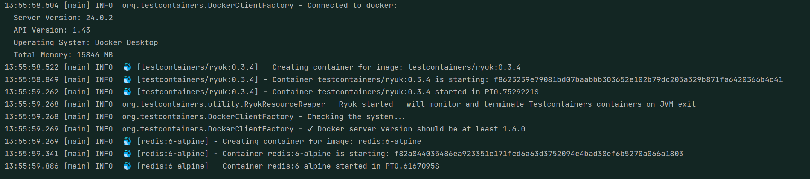
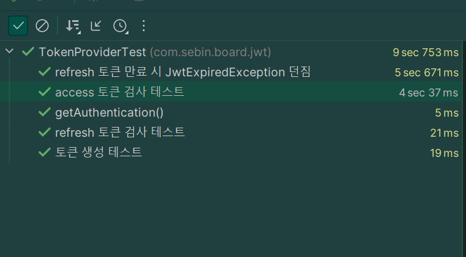

# Refresh Token(리프레시 토큰)이란 ?

Access Token이 탈취 될 경우 악용 될 위험이 있다. 따라서 Access Token의 유효시간을 짧게 설정해준다. Access Token의 유효시간이 짧기 때문에 유효시간이 만료된다면 사용자는 다시 로그인 해야하는 번거로움이 있다. 이를 해소하기 위해 유효시간이 비교적 긴 Refresh Token을 발급하고, Access Token이 만료되었다면 Refresh Token의 조회 결과에 따라 Access Token을 다시 발급하게 된다.

# Redis를 사용하게 된 계기

Refresh 토큰을 관리하기 위한 데이터베이스로 MongoDB, Redis 중에 고민을 했고 Redis를 사용하기로 결정했다.

# Redis는 무엇일까 ?

- Redis는 NoSQL(기존 RDBMS 방식을 탈피한 데이터베이스를 의미)이다.
- 메모리 기반 데이터베이스

# NoSQL의 종류

- 서로 연관된 그래프 형식의 데이터를 저장할 수 있는 Graph Store
- Row가 아닌 Column 위주로 데이터를 저장하는 Column Store
- 비정형 대량 데이터를 저장하기 위한 Document Store
- 메모리 기반으로 빠르게 데이터를 읽어올 수 있는 Key-Value Store

> > **_REDIS_** 는 Key-Value Store에 속한다.

그렇다면 자바 HashMap과 별 차이가 없는거 아닌가 ? 라는 생각이 들었다. 메모리 기반, key-value 구조로 보면 HashMap과 일치하기 때문이다.

> > Redis 설정은 다음과 같다

```java
package com.sebin.board.config;

import lombok.Getter;
import lombok.RequiredArgsConstructor;
import org.springframework.beans.factory.annotation.Value;
import org.springframework.context.annotation.Bean;
import org.springframework.context.annotation.Configuration;
import org.springframework.data.redis.connection.RedisConnectionFactory;
import org.springframework.data.redis.connection.lettuce.LettuceConnectionFactory;
import org.springframework.data.redis.core.RedisTemplate;
import org.springframework.data.redis.repository.configuration.EnableRedisRepositories;
import org.springframework.data.redis.serializer.StringRedisSerializer;

@Getter
@Configuration
@RequiredArgsConstructor
public class RedisConfig {
    @Value("${spring.data.redis.host}")
    private String host;

    @Value("${spring.data.redis.port}")
    private int port;

    @Bean
    public RedisConnectionFactory redisConnectionFactory() {
        return new LettuceConnectionFactory(host, port);
    }

    @Bean
    public RedisTemplate<String, Object> redisTemplate() {
        RedisTemplate<String, Object> redisTemplate = new RedisTemplate<>();
        redisTemplate.setConnectionFactory(redisConnectionFactory());

        // 일반적인 key:value의 경우 시리얼라이저
        redisTemplate.setKeySerializer(new StringRedisSerializer());
        redisTemplate.setValueSerializer(new StringRedisSerializer());

        // Hash를 사용할 경우 시리얼라이저
        redisTemplate.setHashKeySerializer(new StringRedisSerializer());
        redisTemplate.setHashValueSerializer(new StringRedisSerializer());

        // 모든 경우
        redisTemplate.setDefaultSerializer(new StringRedisSerializer());

        return redisTemplate;
    }
}
```

레디스 템플릿은 사용하는 자료구조마다 제공하는 메서드가 다르기 때문에 객체를 만들어서 레디스의 자료구조 타입에 맞는 메소드를 사용하면 된다.

| 메서드명    | 레디스 타입 |
| :---------- | :---------- |
| opsForValue | String      |
| opsForList  | Set         |
| opsForZSet  | Sorted Set  |
| opsForHash  | Hash        |

데이터를 저장할 때 만료 시간 지정할 시에는 해당 시간의 단위까지 지정해주면 된다. 위의 코드에서는 밀리 초(TimeUnit.MILLISECONDS)로 적용되어 있다.

TestContainer를 통해 Redis 컨테이너를 실행시켜 테스트와 로컬환경을 격리했다.



Docker Desktop에 컨테이너가 실행되고 종료되는 모습을 확인할 수 있다.



테스트 로그창에 Docker 컨테이너가 실행되고 종료되는 것을 확인 할 수 있다.

이제 RedisService를 이용한 RefreshToken 테스트를 실행할 준비를 마쳤다.

먼저 RedisService를 살펴보자.

```
public interface RedisService {
    public void setData(String key, String value, Long expiredTime); // 데이터를 저장한다

    public String getData(String key); // 데이터를 조회한다

    public void deleteData(String key); // 데이터를 삭제한다.
}

```

RedisService를 구현한 RedisServiceImpl은 다음과 같다.

```java
package com.sebin.board.service;

import io.jsonwebtoken.ExpiredJwtException;
import java.util.Optional;
import lombok.RequiredArgsConstructor;
import lombok.extern.slf4j.Slf4j;
import org.springframework.data.redis.core.RedisTemplate;
import org.springframework.stereotype.Service;

import java.util.concurrent.TimeUnit;

@Service
@Slf4j
@RequiredArgsConstructor
public class RedisServiceImpl implements RedisService {
    private final RedisTemplate<String, Object> redisTemplate;

    @Override
    public void setData(String key, String value, Long expiredTime) {
        // 데이터 저장
        redisTemplate.opsForValue().set(key,value,expiredTime, TimeUnit.MICROSECONDS);
    }

    @Override
    public String getData(String key) {
        // 데이터 셀렉트 --> 반환은 스트링
        String result = (String) redisTemplate.opsForValue().get(key);

        if (result == null) {
            throw new ExpiredJwtException(null, null, "토큰이 만료되었습니다.");
        }
        return result;
    }

    @Override
    public void deleteData(String key) {
        redisTemplate.delete(key);
    }
}

```

만약 유효시간이 만료되었다면 Refresh Token은 Redis에서 삭제한다. 따라서 조회 결과는 null이 되고 이 조회결과가 null일 경우 JwtExpiredException이 발생한다.

의존관계와 테스트코드는 다음과 같다

```mermaid
classDiagram;
RedisServiceImpl <|.. RedisService

```

의존관계

```java
package com.sebin.board.jwt;

import static com.mysema.commons.lang.Assert.assertThat;
import static java.util.stream.Collectors.*;
import static org.assertj.core.api.AssertionsForClassTypes.assertThatThrownBy;
import static org.hamcrest.Matchers.notNullValue;
import static org.springframework.security.test.web.servlet.setup.SecurityMockMvcConfigurers.springSecurity;
import static org.springframework.test.web.servlet.request.MockMvcRequestBuilders.get;
import static org.springframework.test.web.servlet.request.MockMvcRequestBuilders.post;
import static org.springframework.test.web.servlet.result.MockMvcResultHandlers.print;
import static org.springframework.test.web.servlet.result.MockMvcResultMatchers.jsonPath;

import com.sebin.board.config.code.TestContainerConfig;
import com.sebin.board.dto.MemberInfoDto;
import com.sebin.board.dto.TokenDto;
import com.sebin.board.reposiotry.queryrepository.MemberQueryRepository;
import com.sebin.board.service.RedisService;
import io.jsonwebtoken.ExpiredJwtException;
import lombok.extern.slf4j.Slf4j;
import org.assertj.core.api.Assertions;
import org.junit.jupiter.api.DisplayName;
import org.junit.jupiter.api.Test;
import org.junit.jupiter.api.extension.ExtendWith;
import org.springframework.beans.factory.annotation.Autowired;
import org.springframework.boot.test.context.SpringBootTest;
import org.springframework.security.core.Authentication;
import org.springframework.security.core.GrantedAuthority;
import org.springframework.security.core.context.SecurityContextHolder;
import org.springframework.security.test.context.support.WithMockUser;
import org.springframework.transaction.annotation.Transactional;

import java.util.Date;

@SpringBootTest
@Transactional
@ExtendWith(TestContainerConfig.class)
@Slf4j
class TokenProviderTest extends TestContainerConfig {

  private static final long ACCESS_TOKEN_EXPIRE_TIME = 1000 * 3; // 토큰 만료 테스트를 위한 시간 설정
  private static final long REFRESH_TOKEN_EXPIRE_TIME = 1000 * 3; // 토큰 만료 테스트를 위한 시간 설정
  @Autowired
  RedisService redisService;
  @Autowired
  MemberQueryRepository memberQueryRepository;
  @Autowired
  private TokenProvider tokenProvider;

  @Test
  @DisplayName("refresh 토큰 검사 테스트")
  @WithMockUser
  void validateRefreshToken() throws InterruptedException {
    // given
    Authentication authentication = SecurityContextHolder.getContext()
        .getAuthentication(); // MockUser 꺼내기
    String authorities = authentication.getAuthorities().stream()
        .map(GrantedAuthority::getAuthority).collect(joining(","));
    long now = new Date().getTime();
    Date refreshTokenExpiresIn = new Date(now + ACCESS_TOKEN_EXPIRE_TIME);
    String refreshToken = tokenProvider.generateRefreshToken(authentication, REFRESH_TOKEN_EXPIRE_TIME);
    redisService.setData(authentication.getName(), refreshToken,
        refreshTokenExpiresIn.getTime()); // redis에 저장 만료시간은 3초로 설정

    // when
    String findRefreshToken = redisService.getData(authentication.getName());

    // that
    Assertions.assertThat(findRefreshToken).isEqualTo(refreshToken);
  }

  @Test
  @DisplayName("refresh 토큰 만료 시 JwtExpiredException 던짐")
  @WithMockUser
  void throwJwtExpiredExceptionByExpirationOfRefreshToken() throws InterruptedException {
    // given
    Authentication authentication = SecurityContextHolder.getContext()
        .getAuthentication(); // MockUser 꺼내기
    String authorities = authentication.getAuthorities().stream()
        .map(GrantedAuthority::getAuthority).collect(joining(","));
    long now = new Date().getTime();
    Date refreshTokenExpiresIn = new Date(now +REFRESH_TOKEN_EXPIRE_TIME);
    String refreshToken = tokenProvider.generateRefreshToken(authentication, REFRESH_TOKEN_EXPIRE_TIME);
    redisService.setData(authentication.getName(), refreshToken,
        1000 * 1L); // redis에 저장 만료시간은 3초로 설정

    // when
    Thread.sleep(5000); // 5초 기다린다
    ; // redis에서 조회한다.

    // that
    assertThatThrownBy(() -> redisService.getData(
        authentication.getName()))
        .isInstanceOf(ExpiredJwtException.class);// 만료시간이 경과되었으므로 redis에서 조회되지 않고 Exception 발생

  }
}
```

# 테스트 결과



테스트가 정상적으로 실행되고 성공한 것을 확인할 수 있다.
