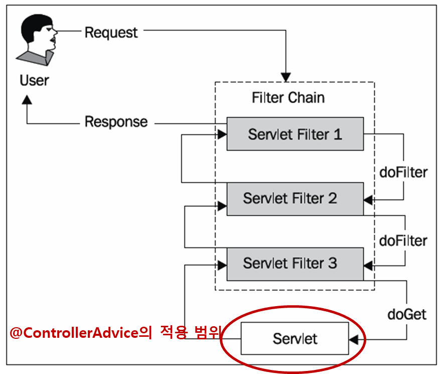
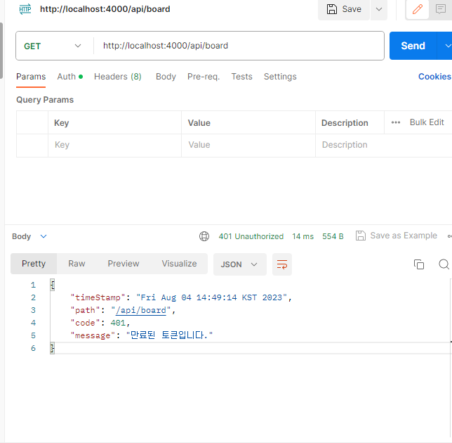

# 문제 원인

기존에 다음과 같이 Controller의 Exception을 처리하고 있었다.

```java
package com.sebin.board.exhandler.advice;

import static java.util.stream.Collectors.*;

import com.sebin.board.exception.DuplicateIdException;
import com.sebin.board.exhandler.ErrorResult;
import jakarta.servlet.http.HttpServletRequest;
import java.util.Date;
import java.util.List;
import java.util.stream.Collectors;
import lombok.extern.slf4j.Slf4j;
import org.springframework.boot.context.properties.bind.validation.ValidationErrors;
import org.springframework.http.HttpStatus;
import org.springframework.http.HttpStatusCode;
import org.springframework.validation.BindException;
import org.springframework.validation.BindingResult;
import org.springframework.validation.FieldError;
import org.springframework.web.bind.MethodArgumentNotValidException;
import org.springframework.web.bind.annotation.ExceptionHandler;
import org.springframework.web.bind.annotation.ResponseBody;
import org.springframework.web.bind.annotation.ResponseStatus;
import org.springframework.web.bind.annotation.RestControllerAdvice;
import org.springframework.web.servlet.mvc.method.annotation.ResponseEntityExceptionHandler;

@Slf4j
@RestControllerAdvice(basePackages = "com.sebin.board.controller")
public class AuthControllerAdvice {


  @ResponseStatus(HttpStatus.LOCKED)
  @ExceptionHandler(DuplicateIdException.class)
  public ErrorResult duplicateIdExHandler(DuplicateIdException e, HttpServletRequest request) {
    log.error("[exceptionHandler] ex", e);
    return ErrorResult.builder().timeStamp(getTimeStamp()).code(HttpStatus.LOCKED.value())
        .message(e.getMessage()).path(request.getServletPath()).build();
  }


  @ResponseStatus(HttpStatus.BAD_REQUEST)
  @ExceptionHandler(MethodArgumentNotValidException.class)
  public ErrorResult methodArgumentExHandler(MethodArgumentNotValidException e, HttpServletRequest request) {
    BindingResult bindingResult = e.getBindingResult();
    FieldError fieldError = bindingResult.getFieldError();
    String message = fieldError.getDefaultMessage();
    return ErrorResult.builder().timeStamp(getTimeStamp()).code(HttpStatus.BAD_REQUEST.value())
        .message(message).path(request.getServletPath()).build();
  }

  private String getTimeStamp() {
    return new Date().toString();
  }
}
```

---

그러나 ControllerAdvice는 Filter에서 발생하는 Exception을 처리해주지 못한다.

그 이유는



출처 : https://sjh836.tistory.com/165

Filter에서 발생한 예외는 ControllerAdvice의 적용 범위 밖이기 때문이다.

# 해결 방법

```java
    @Override
    protected void doFilterInternal(HttpServletRequest request, HttpServletResponse response, FilterChain filterChain) throws ServletException, IOException {
        String jwt = resolveToken(request);

        try {
            if (StringUtils.hasText(jwt) && tokenProvider.validateToken(jwt)) {
                Authentication authentication = tokenProvider.getAuthentication(jwt);
                SecurityContextHolder.getContext().setAuthentication(authentication);
            }
        } catch (ExpiredJwtException e) {
            setErrorResponse(HttpStatus.UNAUTHORIZED, request, response, "만료된 토큰입니다.");
            return;
        }
        filterChain.doFilter(request, response);
    }

    private void setErrorResponse(HttpStatus httpStatus, HttpServletRequest request,
        HttpServletResponse response, String message) {
        ObjectMapper objectMapper = new ObjectMapper();
        response.setContentType(MediaType.APPLICATION_JSON_VALUE);
        response.setCharacterEncoding(StandardCharsets.UTF_8.name());
        response.setStatus(httpStatus.value());
        ErrorResult errorResult = ErrorResult.builder().code(httpStatus.value())
            .message(message).timeStamp(new Date().toString()).path(request.getServletPath()).build();

        try {
            response.getWriter().write(objectMapper.writeValueAsString(errorResult));
        } catch (IOException e) {
            log.error("response error", e);
        }
    }
```

기존 jwt필터 유효성 검사 과정을 try-catch문으로 감싸고, exception이 발생할 경우 setErrorReponse 메서드를 통해 Error 결과를 반환하는 방법을 사용했다.

# 결과



ControllerAdvice와 동일하게 error 결과과 출력되는 것을 확인 할 수 있다.

